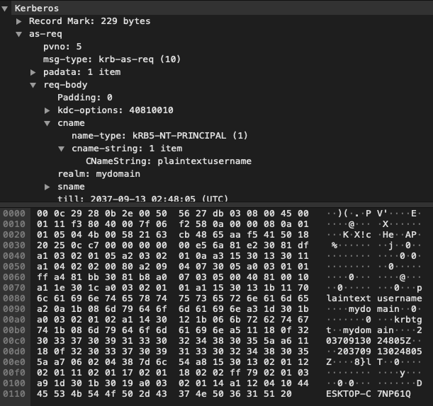
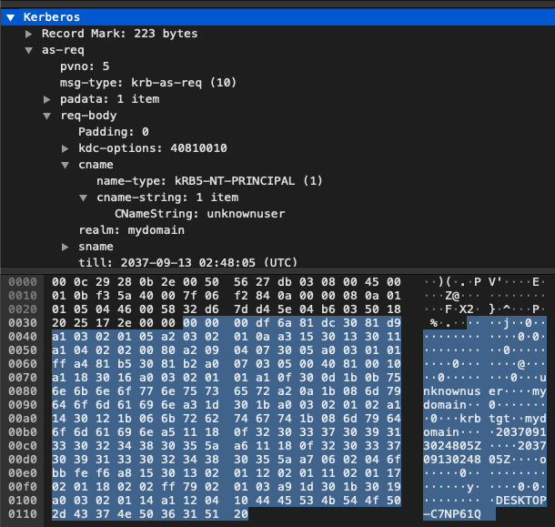
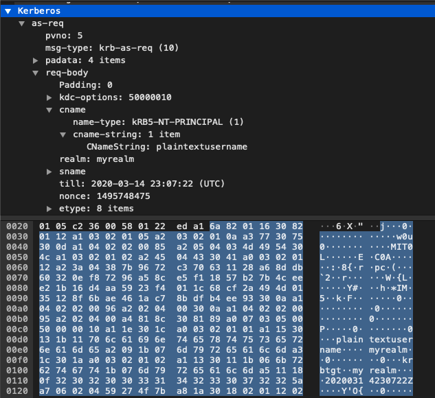
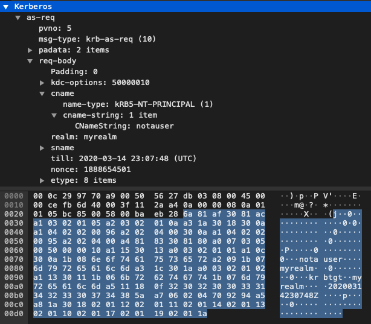
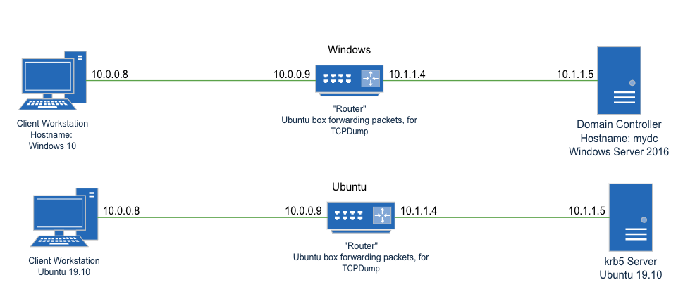

# Problem statement: Kerberos logon process, step 2:  2. The client encrypts the username with AES for transmission to the KDC (as taken from CISSP Official study guide, Sybex, 8e, p. 604; Chapple, M. Stewart, JM. & Gibson, D.) is incorrect.

## Evidence:

### The complete list of steps from CISSP Official study guide, Sybex, 8e, p. 604:

1. The user types a username and password into the client.
2. The client encrypts the username with AES for transmission to the KDC. 
3. The KDC verifies the username against a database of known credentials.
4. The KDC generates a symmetric key that will be used by the client and the Kerberos server. It encrypts this with a hash of the user’s password. The KDC also generates an encrypted time-stamped TGT.
5. The KDC then transmits the encrypted symmetric key and the encrypted time-stamped TGT to the client.
6. The client installs the TGT for use until it expires.

Logically, step two and three can't co-exist. If the username is encrypted, either it needs to be encrypted with a Pre-shared key (PSK) that is NOT the users password, or a PSK that IS a hash of the users password. 

If the username is encrypted with a hash of the users password, then when it gets to the KDC, the KDC needs to bruteforce this auth attempt with the password for EVERY user in it's database, unless another piece of identifying information is passed with the encrypted username.

Alternatively, the PSK is NOT based on the users password, but in this case, the AES password needs to be sent to the requesting system across the network in either cleartext, or using something like Dhiffie Hellman Key Exchange. I've never read this being the case, nor observed it. Nontheless, we allow for this in our testing environment.

### Source of truth (theoretically) the RFC:

https://tools.ietf.org/html/rfc4120#section-3.1.1

```
In the request, the client sends (in cleartext) its own identity and
   the identity of the server for which it is requesting credentials,
   other information about the credentials it is requesting, and a
   randomly generated nonce, which can be used to detect replays and to
   associate replies with the matching requests.
```
### PCAP, or How It Actually Works

#### 1.pcap: Windows, plaintextusername

This pcap contains the CNameString plaintextusername, and the realm mydomain, being passed across the network in clear text, in packet 4.



#### 2.pcap: Windows, unknownuser

This pcap contains the CNameString unknownuser, and the realm mydomain, being passed across the network in clear text, in packet 6.



#### 3.pcap: Ubuntu, plaintextusername

This pcap contains the CNameString plaintextusername, and the realm myrealm, being passed across the network in clear text, in packet 4. 



#### 4.pcap: Ubuntu, unknownuser

This pcap contains the CNameString unknownuser, and the realm myrealm, being passed across the network in clear text, in packet 6.



## Conclusion

As the RFC quoted and testing undertaken have shown, neither in theory nor practice is the Authors assertion that at step two of kerberos authentication "The client encrypts the username with AES for transmission to the KDC" acccurate.

## Appendix: Lab setup

A diagram of the lab configuration is below.



### Shared

This machine was set up to emulate a stupid network tap. IF this machine can see credentials passing over the network in plaintext, then we know that PSK passing for AES can't be in place, because if it was, this machine wouldn't know what it was, OR tcpdump wouldn't apply it automatically.

Router was set up following this process
https://www.ascinc.com/blog/linux/how-to-build-a-simple-router-with-ubuntu-server-18-04-1-lts-bionic-beaver/

tcpdump was executed with -i ens35 -w ~/<name>.pcap

```
#!/bin/bash

# /etc/rc.local

# Default policy to drop all incoming packets.
iptables -P INPUT DROP
iptables -P FORWARD DROP

# Accept incoming packets from localhost and the LAN interface.
iptables -A INPUT -i lo -j ACCEPT
iptables -A INPUT -i ens34 -j ACCEPT

# Accept incoming packets from the WAN if the router initiated the connection.
iptables -A INPUT -i ens35 -m conntrack \
--ctstate ESTABLISHED,RELATED -j ACCEPT

# Forward LAN packets to the WAN.
iptables -A FORWARD -i ens34 -o ens35 -j ACCEPT

# Forward WAN packets to the LAN if the LAN initiated the connection.
iptables -A FORWARD -i ens35 -o ens34 -m conntrack \
--ctstate ESTABLISHED,RELATED -j ACCEPT

# NAT traffic going out the WAN interface.
iptables -t nat -A POSTROUTING -o eth0 -j MASQUERADE

# rc.local needs to exit with 0
exit 0
```

```
deloril@ubuntu:~$ ip address
1: lo: <LOOPBACK,UP,LOWER_UP> mtu 65536 qdisc noqueue state UNKNOWN group default qlen 1000
    link/loopback 00:00:00:00:00:00 brd 00:00:00:00:00:00
    inet 127.0.0.1/8 scope host lo
       valid_lft forever preferred_lft forever
    inet6 ::1/128 scope host 
       valid_lft forever preferred_lft forever
2: ens33: <BROADCAST,MULTICAST,UP,LOWER_UP> mtu 1500 qdisc fq_codel state UP group default qlen 1000
    link/ether 00:50:56:28:f5:01 brd ff:ff:ff:ff:ff:ff
    inet 172.16.68.129/24 brd 172.16.68.255 scope global dynamic noprefixroute ens33
       valid_lft 1732sec preferred_lft 1732sec
    inet6 fe80::f34e:6be1:573c:7e38/64 scope link noprefixroute 
       valid_lft forever preferred_lft forever
3: ens34: <BROADCAST,MULTICAST,UP,LOWER_UP> mtu 1500 qdisc fq_codel state UP group default qlen 1000
    link/ether 00:50:56:30:10:02 brd ff:ff:ff:ff:ff:ff
    inet 10.0.0.9/24 brd 10.0.0.255 scope global noprefixroute ens34
       valid_lft forever preferred_lft forever
    inet6 fe80::20e1:c419:da20:3547/64 scope link noprefixroute 
       valid_lft forever preferred_lft forever
4: ens35: <BROADCAST,MULTICAST,UP,LOWER_UP> mtu 1500 qdisc fq_codel state UP group default qlen 1000
    link/ether 00:50:56:27:db:03 brd ff:ff:ff:ff:ff:ff
    inet 10.1.1.4/24 brd 10.1.1.255 scope global noprefixroute ens35
       valid_lft forever preferred_lft forever
    inet6 fe80::f57b:5f31:8c5e:87e3/64 scope link noprefixroute 
       valid_lft forever preferred_lft forever
```

### Windows

#### Server Setup

Use Server Manager to add the Role "Active Directory Domain Services" and dependencies only.
Promote server to domain controller, creating a new forest called mydomain.hidden
Accept forest and domain functional lecels of Windows Server 2016
Password: <redacted>
Accept netbios name of mydomain

Once installed and rebooted, create a user called plaintextusername.
Add this user to domain administrators, because we're lazy and don't want hiccups.

#### Workstation

Join to the domain, prior to logging packets. This is because when I didn't, NTLM authentication was used, and I hadn't the time to work out how to force kerberos.

Restart machine.

#### Execution:

On the client, attempt to authenticate as mydomain\plaintextusername and mydomain\unknownuser.

### Linux

#### Server Setup

https://help.ubuntu.com/lts/serverguide/kerberos.html

```
sudo apt install krb5-kdc krb5-admin-server
Realm: myrealm
Kerberos Server: 127.0.0.1
AS: 127.0.0.1

sudo krb5_newrealm
Password: <redacted>

sudo dpkg-reconfigure krb5-kdc

sudo kadmin.local
kadmin.local: addprinc plaintextusername
Password for user: <redacted>
quit

sudo vim /etc/krb5kdc/kadm5.acl
add line 
    plaintextusername@myrealm        *
:wq

sudo systemctl restart krb5-admin-server.service

kinit plaintextusername

deloril@ubuntu:~$ klist
Ticket cache: FILE:/tmp/krb5cc_1000
Default principal: plaintextusername@myrealm

Valid starting       Expires              Service principal
03/13/2020 15:39:57  03/14/2020 01:39:57  krbtgt/myrealm@myrealm
	renew until 03/14/2020 15:39:55

```

#### Client setup

https://help.ubuntu.com/lts/serverguide/kerberos.html

```
sudo apt install krb5-user libpam-krb5
Realm: myrealm
Server: 10.1.1.5
AS: 10.1.1.5
```

#### Execution

From client:

```
kinit plaintextusername@myrealm
password: <redacted>

deloril@ubuntu:~$ klist
Ticket cache: FILE:/tmp/krb5cc_1000
Default principal: plaintextusername@myrealm

Valid starting       Expires              Service principal
03/13/2020 16:00:04  03/14/2020 02:00:04  krbtgt/myrealm@myrealm
	renew until 03/14/2020 16:00:01
```

Interestingly, ubuntu doesn't ask for a password when you run kinit until AFTER it receives the response from the server indicating the username was valid or not. This makes sense, but was interesting to me.

